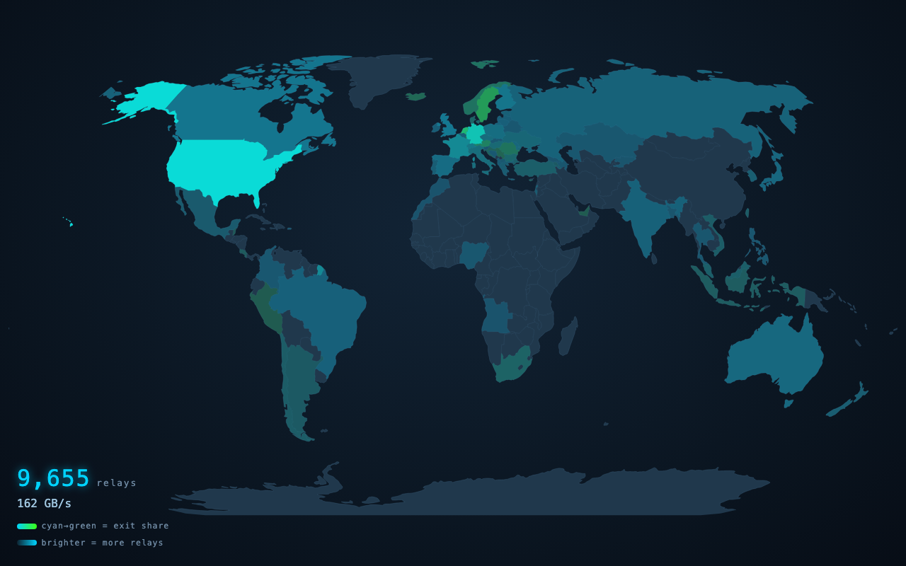

# obfina

A real-time, interactive visualization of the Tor network.

## Why it exists

Tor routes traffic through thousands of volunteer-run relays across dozens of countries. The network is healthy, globally distributed, and surprisingly fragile — governments block it, relays go offline, bandwidth concentrates in unexpected places. None of this is visible to most people who use Tor, and even network operators lack a compelling way to see the whole picture at once.

obfina makes the Tor network observable. Not through tables and CSV exports, but through a world map where each country's place in the network reads at a glance.

## What it does

obfina is a set of linked views over the same network, switchable from the nav rail, with number keys `1`–`6`, or by cycling with `←`/`→` (or `[`/`]`); `Esc` clears the current selection. The active view is saved to `?view=…` so any view is shareable. On narrow screens the nav rail collapses to a hamburger menu. See [ADR-009](docs/decisions/009-multi-view.md).

- **Map** — value-by-alpha world map: hue encodes exit share (cyan → green) and brightness encodes relay count, so the busiest countries glow while the rest recede. Click a country for its relay count, bandwidth, Guard/Middle/Exit composition, top autonomous systems, and a relay list with bandwidth bars; pan & zoom into dense regions like Europe.
- **Hosting** — centralization risk by autonomous system (hosting provider), as Lorenz curves with a Gini score and the top ASes — shown both for the whole network and for exit capacity alone, where concentration bites hardest. Click an AS for a detail panel with its relay list and bandwidth share.
- **Paths** — how much of all traffic rides on a few high-bandwidth relays: a concentration curve you can drag to read "the top N% of relays carry M% of traffic."
- **Growth** — the network over time: relay count, advertised capacity vs. bandwidth actually consumed, and estimated users by country (from Tor Metrics). Trend data is cached for the session so switching views does not re-fetch.
- **Circuits** — real Guard → Middle → Exit paths, sampled from live relays by their actual selection weight and animated across the map. Relay dots are placed inside each country's polygon via rejection sampling.
- **About** — data sources and references displayed as cards.
- **Ambient mode** — leave any view on a screen and it conveys the network's shape without interaction.

## Data

obfina pulls from two authoritative sources maintained by the Tor Project:

- [Onionoo](https://onionoo.torproject.org/) — per-relay details, bandwidth, uptime, country (no precise coordinates)
- [Tor Metrics](https://metrics.torproject.org/) — aggregate statistics, historical trends, censorship signals

Data is refreshed every 5–30 minutes via a server-side cache layer (relay data: 10 min, censorship signals: 5 min, aggregate stats: 30 min). Relay data shown in the app may lag up to 3–6 hours behind the live network due to Onionoo's consensus ingestion cycle.

## Tech stack

| Layer        | Technology                             |
| ------------ | -------------------------------------- |
| Framework    | SvelteKit                              |
| Map          | D3 (d3-geo, d3-zoom) + world-atlas     |
| Country join | i18n-iso-countries (numeric → alpha-2) |
| Animation    | Svelte built-ins                       |
| Styling      | Tailwind CSS                           |
| Hosting      | Cloudflare Pages + Workers             |
| Cache        | Cloudflare KV                          |
| IaC          | Terraform                              |
| CI/CD        | GitHub Actions                         |

## Documentation

- [Architecture](docs/architecture.md) — system overview and design principles
- [Architecture Decision Records](docs/decisions/) — individual records for each major technology choice
- [Data Sources](docs/data-sources.md) — API reference, data quality notes, caveats
- [Development](docs/development.md) — local setup guide
- [Infrastructure](docs/infrastructure.md) — Terraform and deployment

## Acknowledgements

obfina would not exist without the work of the [Tor Project](https://www.torproject.org/) and the volunteers who run Tor relays worldwide. Network data is provided by [Onionoo](https://onionoo.torproject.org/) and [Tor Metrics](https://metrics.torproject.org/) — both maintained by the Tor Project.
