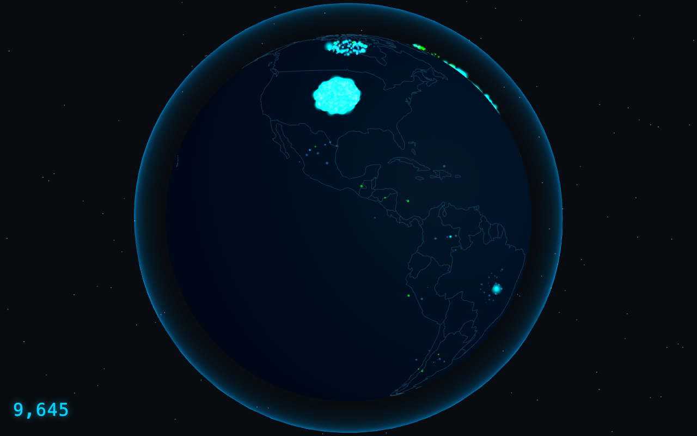

# obfina

A real-time, interactive visualization of the Tor network.

## Why it exists

Tor routes traffic through thousands of volunteer-run relays across dozens of countries. The network is healthy, globally distributed, and surprisingly fragile — governments block it, relays go offline, bandwidth concentrates in unexpected places. None of this is visible to most people who use Tor, and even network operators lack a compelling way to see the whole picture at once.

obfina makes the Tor network observable. Not through tables and CSV exports, but through a 3D globe where the network breathes in real time.

## What it does

- **Relay globe** — every running relay rendered as a node, sized by bandwidth, colored by flag type (Guard, Exit, Middle)
- **Country drill-down** — click any country to see its relay count, aggregate bandwidth, and AS diversity
- **Censorship indicator** — countries where Tor usage has dropped anomalously surface visually, without requiring the user to know what they're looking for
- **Ambient mode** — leave it on a screen and it tells you the network's health without any interaction

## Data

obfina pulls from two authoritative sources maintained by the Tor Project:

- [Onionoo](https://onionoo.torproject.org/) — per-relay details, bandwidth, uptime, geolocation
- [Tor Metrics](https://metrics.torproject.org/) — aggregate statistics, historical trends, censorship signals

Data is refreshed every 5–30 minutes via a server-side cache layer (relay data: 10 min, censorship signals: 5 min, aggregate stats: 30 min). Relay data shown in the app may lag up to 3–6 hours behind the live network due to Onionoo's consensus ingestion cycle.

## Tech stack

| Layer     | Technology                 |
| --------- | -------------------------- |
| Framework | SvelteKit                  |
| 3D Globe  | Threlte + Three.js         |
| Charts    | D3.js                      |
| Animation | Svelte built-ins + GSAP    |
| Styling   | Tailwind CSS               |
| Hosting   | Cloudflare Pages + Workers |
| Cache     | Cloudflare KV              |
| IaC       | Terraform                  |
| CI/CD     | GitHub Actions             |

## Documentation

- [Architecture](docs/architecture.md) — system overview and design principles
- [Architecture Decision Records](docs/decisions/) — individual records for each major technology choice
- [Data Sources](docs/data-sources.md) — API reference, data quality notes, caveats
- [Development](docs/development.md) — local setup guide
- [Infrastructure](docs/infrastructure.md) — Terraform and deployment

## Acknowledgements

obfina would not exist without the work of the [Tor Project](https://www.torproject.org/) and the volunteers who run Tor relays worldwide. Network data is provided by [Onionoo](https://onionoo.torproject.org/) and [Tor Metrics](https://metrics.torproject.org/) — both maintained by the Tor Project.
