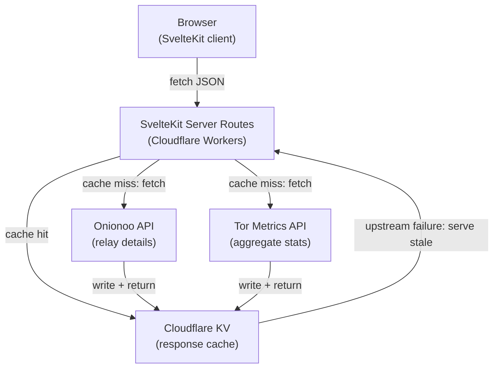

# Architecture

## Overview

obfina is a single-page web application that visualizes the Tor network in real time. It presents several linked **views** over one dataset, switchable from a nav rail, the number keys `1`–`5`, or `←`/`→`; the active view is mirrored to `?view=…` for deep-linking (see [ADR-009](decisions/009-multi-view.md)).

The default view is a 2D **value-by-alpha** world map (D3 + SVG): every country is drawn as a visible land base, and countries with relays glow on top — hue encodes exit share (cyan → green) and opacity encodes relay count. The map first loads a compact per-country relay summary, then fetches full relay details for the Guard → Middle → Exit path simulation and drill-down panels. Paths are sampled from live relays by selection weight and animated as a non-interactive background simulation on the same map. The map uses an equirectangular projection fitted to viewport height so the poles sit at the top/bottom edges; it pans and zooms, wraps seamlessly east–west (no left/right edge), and clamps vertical panning at the poles. The other views reframe the same network:

- **Hosting** — per-AS centralization risk (Lorenz curves + Gini), all relays vs. exit-only; click an AS for a detail panel with its relay list and bandwidth share.
- **Paths** — per-relay path-selection concentration, read interactively.
- **Growth** — relay count, advertised vs. consumed bandwidth, and users by country over time; data is cached in-session.
- **About** — data sources and references as cards.

A server-side cache layer mediates between upstream Tor APIs and the client, keeping data fresh without hammering external services.

> The visualization began as a 3D WebGL globe (Threlte + Three.js), then a proportional-symbol bubble map, then a single value-by-alpha map, before growing into the linked-view exhibit it is now. See [ADR-007](decisions/007-2d-map-over-globe.md), [ADR-008](decisions/008-value-by-alpha.md), and [ADR-009](decisions/009-multi-view.md).

## System diagram

## Technology decisions

Major technology choices are recorded individually as Architecture Decision Records (ADRs) in [`docs/decisions/`](decisions/). Each ADR documents the context, the decision, and its consequences — including tradeoffs.

| ADR                                             | Decision                                                    |
| ----------------------------------------------- | ----------------------------------------------------------- |
| [ADR-001](decisions/001-sveltekit.md)           | Use SvelteKit as the application framework                  |
| [ADR-002](decisions/002-threlte.md)             | Use Threlte + Three.js for 3D rendering (superseded)        |
| [ADR-003](decisions/003-d3.md)                  | Use D3.js for geography and data-driven visuals             |
| [ADR-004](decisions/004-cloudflare-stack.md)    | Host entirely on Cloudflare                                 |
| [ADR-005](decisions/005-cloudflare-kv-cache.md) | Use Cloudflare KV for API response caching                  |
| [ADR-006](decisions/006-terraform.md)           | Use Terraform for infrastructure management                 |
| [ADR-007](decisions/007-2d-map-over-globe.md)   | Use a 2D D3 map instead of a 3D globe                       |
| [ADR-008](decisions/008-value-by-alpha.md)      | Use a value-by-alpha encoding for the country map           |
| [ADR-009](decisions/009-multi-view.md)          | Add linked views and keep circuit simulation inside the map |

## Caching strategy

| Endpoint                | TTL    | Rationale                                               |
| ----------------------- | ------ | ------------------------------------------------------- |
| `/api/relays?summary=1` | 10 min | Compact startup payload; Onionoo updates every ~3 hours |
| `/api/relays`           | 10 min | Full relay details; polling more often is wasteful      |
| `/api/trends`           | 30 min | Tor Metrics CSV exports update about once a day         |

`/api/relays?summary=1` returns country-level counts, observed bandwidth, and Guard/Middle/Exit composition for fast map startup. `/api/relays` returns the per-relay fields the analysis views share: `country`, `flags`, `observed_bandwidth`, `consensus_weight`, the per-position selection probabilities (`guard`/`middle`/`exit`), `as`/`as_name`, and `first_seen`. `/api/trends` proxies and downsamples three Tor Metrics CSVs (network size, advertised vs. consumed bandwidth, per-country users) into one compact payload; each section degrades independently if its CSV is unavailable.

Cache entries are stored as JSON strings in Cloudflare KV. On a cache miss the Worker fetches upstream, schedules the KV write with `waitUntil()` when the platform provides it, and returns the fresh response without waiting for the write to finish. KV TTL is a hard expiry — background revalidation does not happen automatically.

During an upstream outage, the Worker attempts to serve a cached value if one is still available and marks the payload `stale: true`. If no cached value exists, the API returns an empty dataset with an explicit `unavailable: true` flag so the client can render a degraded state rather than a broken one.

## Design principles

**Minimal text.** Quantitative data is encoded in visual channels — brightness, size, color, motion — before resorting to labels or numbers. Text appears in detail panels that the user must actively open.

**Experience first, exploration second.** The default view is ambient and self-explanatory. Interaction reveals progressively more detail without disrupting the ambient state.

**Dark aesthetic.** The visual language draws from terminal UIs and network monitoring tools: near-black backgrounds, phosphor-glow accents, monospace typography in detail panels.
