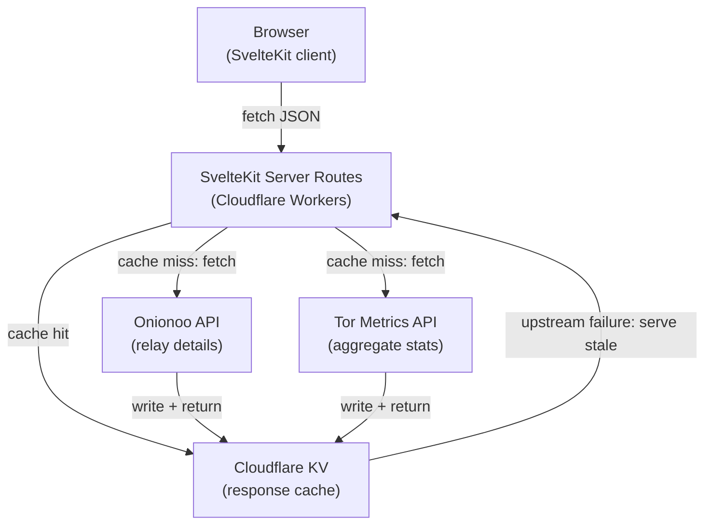

# Architecture

## Overview

obfina is a single-page web application that visualizes the Tor network in real time. The centerpiece is a 3D globe rendered in WebGL, overlaid with relay nodes, bandwidth arcs, and ambient animations. A server-side cache layer mediates between upstream Tor APIs and the client, keeping data fresh without hammering external services.

## System diagram

## Technology decisions

Major technology choices are recorded individually as Architecture Decision Records (ADRs) in [`docs/decisions/`](decisions/). Each ADR documents the context, the decision, and its consequences — including tradeoffs.

| ADR                                             | Decision                                    |
| ----------------------------------------------- | ------------------------------------------- |
| [ADR-001](decisions/001-sveltekit.md)           | Use SvelteKit as the application framework  |
| [ADR-002](decisions/002-threlte.md)             | Use Threlte + Three.js for 3D rendering     |
| [ADR-003](decisions/003-d3.md)                  | Use D3.js for supplementary charts          |
| [ADR-004](decisions/004-cloudflare-stack.md)    | Host entirely on Cloudflare                 |
| [ADR-005](decisions/005-cloudflare-kv-cache.md) | Use Cloudflare KV for API response caching  |
| [ADR-006](decisions/006-terraform.md)           | Use Terraform for infrastructure management |

## Caching strategy

| Endpoint          | TTL    | Rationale                                                      |
| ----------------- | ------ | -------------------------------------------------------------- |
| `/api/relays`     | 10 min | Onionoo updates every ~3 hours; polling more often is wasteful |
| `/api/stats`      | 30 min | Aggregate metrics change slowly                                |
| `/api/censorship` | 5 min  | Blocking events should surface quickly                         |

Cache entries are stored as JSON strings in Cloudflare KV. On a cache miss the Worker fetches upstream, writes to KV with the appropriate TTL, and returns the response. KV TTL is a hard expiry — background revalidation does not happen automatically. To avoid blocking responses on upstream latency after expiry, the Worker initiates a background fetch via `waitUntil()` and returns the slightly-stale cached value while the new value is written asynchronously.

During an upstream outage, the Worker serves the last-known cached value regardless of TTL, with a response header indicating the data is stale. If no cached value exists, the API returns an empty dataset with an explicit `unavailable: true` flag so the client can render a degraded state rather than a broken one.

## Design principles

**Minimal text.** Quantitative data is encoded in visual channels — brightness, size, color, motion — before resorting to labels or numbers. Text appears in detail panels that the user must actively open.

**Experience first, exploration second.** The default view is ambient and self-explanatory. Interaction reveals progressively more detail without disrupting the ambient state.

**Dark aesthetic.** The visual language draws from terminal UIs and network monitoring tools: near-black backgrounds, phosphor-glow accents, monospace typography in detail panels.
