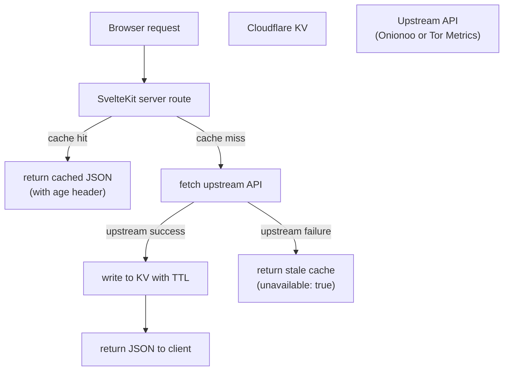

# Data Sources

obfina uses two upstream data sources maintained by the Tor Project.

---

## Onionoo

Base URL: `https://onionoo.torproject.org`

Onionoo provides per-relay and per-bridge data derived from Tor network consensuses. Documents are updated roughly every 3 hours as new consensuses are published.

### Data freshness and consensus lag

Onionoo ingests Tor network consensuses, which are published by directory authorities every hour. However, Onionoo processes them in batches and may lag 3–6 hours behind the live network. A relay that comes online now may not appear in Onionoo's `/summary` endpoint until several hours later. The `relays_published` field in every Onionoo response indicates when the underlying consensus data was last processed — obfina surfaces this timestamp so users know how old the data is.

### Endpoints

#### `GET /summary`

Lightweight list of all relays and bridges. Used to populate the globe with node positions on initial load.

Key fields per relay:

| Field | Type     | Description                          |
| ----- | -------- | ------------------------------------ |
| `n`   | string   | Relay nickname                       |
| `f`   | string   | Fingerprint (40-char hex)            |
| `a`   | string[] | IP addresses                         |
| `r`   | boolean  | Running in the most recent consensus |
| `c`   | string   | Country code (ISO 3166-1 alpha-2)    |

Note: `r` (running) reflects the most recent consensus Onionoo has processed, not real-time status. A relay that went offline minutes ago may still appear as running.

The `/summary` endpoint does not include per-relay bandwidth or location. obfina therefore loads the globe from `/details` with a field filter (`fields=nickname,observed_bandwidth,country,flags`) rather than `/summary`, which returns everything needed for placement and sizing in a single request (~1.2 MB for ~9,600 running relays).

#### `GET /details`

Full relay metadata. Fetched on demand when a user drills into a specific relay or country.

Key fields:

| Field                  | Type     | Description                                                     |
| ---------------------- | -------- | --------------------------------------------------------------- |
| `nickname`             | string   | Relay nickname                                                  |
| `fingerprint`          | string   | Fingerprint                                                     |
| `country`              | string   | Country code                                                    |
| `as`                   | string   | Autonomous system number                                        |
| `as_name`              | string   | AS name                                                         |
| `consensus_weight`     | number   | Probabilistic routing weight in the current consensus           |
| `observed_bandwidth`   | number   | Bytes/sec observed by the relay; used by obfina for node sizing |
| `advertised_bandwidth` | number   | Bytes/sec self-reported by the relay                            |
| `flags`                | string[] | e.g. `["Guard", "Exit", "Stable"]`                              |
| `first_seen`           | string   | ISO 8601 timestamp                                              |
| `last_seen`            | string   | ISO 8601 timestamp                                              |
| `relays_published`     | string   | ISO 8601 timestamp of the consensus this data is derived from   |

**Data quality notes:**

- **Onionoo does not expose per-relay latitude/longitude.** Coordinates were removed from the API for privacy reasons; geolocation is provided only at the country level (`country`, `country_name`) plus optional `as`/`as_name`. obfina therefore places relays on the globe by mapping each relay's `country` code to a country centroid (`src/lib/country-centroids.ts`), with deterministic jitter so relays in the same country fan out rather than stacking on one point. This is verified against the live API: a request for `fields=...latitude,longitude...` returns those fields empty.
- `consensus_weight` is not bandwidth. It is the weight assigned by directory authorities for probabilistic relay selection. A relay with high consensus weight receives proportionally more circuits. It correlates with bandwidth but is not equal to it.
- `observed_bandwidth` and `advertised_bandwidth` are both self-reported by the relay and unverified. obfina uses `observed_bandwidth` for node sizing. The actual measured bandwidth (used for `consensus_weight` calculation) is not exposed via Onionoo.

#### `GET /bandwidth`

Per-relay bandwidth history (read, write) as time series. Used for sparklines in relay detail panels.

#### `GET /weights`

Consensus weight history. Used to show a relay's influence over time.

#### `GET /uptime`

Uptime fraction history. Used in relay detail panels.

### Query parameters

All endpoints accept:

| Parameter | Description                                    |
| --------- | ---------------------------------------------- |
| `search`  | Filter by fingerprint, nickname, or IP         |
| `country` | Filter by ISO country code                     |
| `as`      | Filter by AS number                            |
| `flag`    | Filter by relay flag (e.g. `Guard`, `Exit`)    |
| `running` | `true` to return only currently running relays |
| `fields`  | Comma-separated list of fields to include      |

### Acceptable use

Onionoo does not publish formal rate limits but asks consumers to be polite. Polling more frequently than once per 5 minutes is considered abusive. For questions about API usage, contact the Tor Project's metrics team via [metrics@torproject.org](mailto:metrics@torproject.org).

obfina's cache layer enforces a minimum TTL of 10 minutes for relay data.

---

## Tor Metrics

Base URL: `https://metrics.torproject.org`

Tor Metrics provides aggregate statistics about the network, collected and processed by the Tor Project's metrics team. Data is available as JSON and CSV and is typically updated once per day. It is suitable for historical trend visualizations but not for real-time relay state.

### Key datasets

#### Network size

Estimated number of relays and bridges over time, broken down by relay flags.

Endpoint: `GET /networksize.json`

#### Bandwidth

Aggregate advertised and consumed bandwidth across all relays.

Endpoint: `GET /bandwidth.json`

#### User statistics

Estimated number of directly connecting users per country per day, derived from relay request counts. This is also the primary signal for censorship detection.

Endpoint: `GET /userstats-relay-country.json`

#### Censorship / anomaly detection

When a country's estimated user count drops sharply relative to its recent baseline, it indicates a blocking event. obfina derives a per-country censorship indicator using the following approach:

1. Compute a 30-day rolling average of daily users per country from `userstats-relay-country.json`.
2. Compare the most recent 3-day average against the rolling average.
3. If the ratio drops below 0.5 (users less than half the baseline), the country is flagged as a potential blocking event.
4. The indicator is displayed visually on the globe without a numeric label — the goal is to surface anomalies, not to make precise claims about censorship.

This is a threshold heuristic applied to Tor Metrics data. It is simpler than the active network measurement techniques used by projects like [OONI](https://ooni.org/) (which runs probes on user devices) but requires no additional infrastructure. False positives can occur during measurement gaps or when Tor bridges absorb traffic that was previously counted as direct connections.

#### Onion services

Statistics about the number of `.onion` services and their usage, derived from HSDir relay observations.

Endpoint: `GET /hidserv-dir-onions-seen.json`

---

## Data flow in obfina

The client never calls Onionoo or Tor Metrics directly. All upstream requests are proxied through obfina's server routes, which normalize response shapes, apply caching, and handle upstream failures gracefully. When an upstream API is unavailable and no cached value exists, the API returns `{ unavailable: true }` so the client can render a degraded state rather than a broken one.
