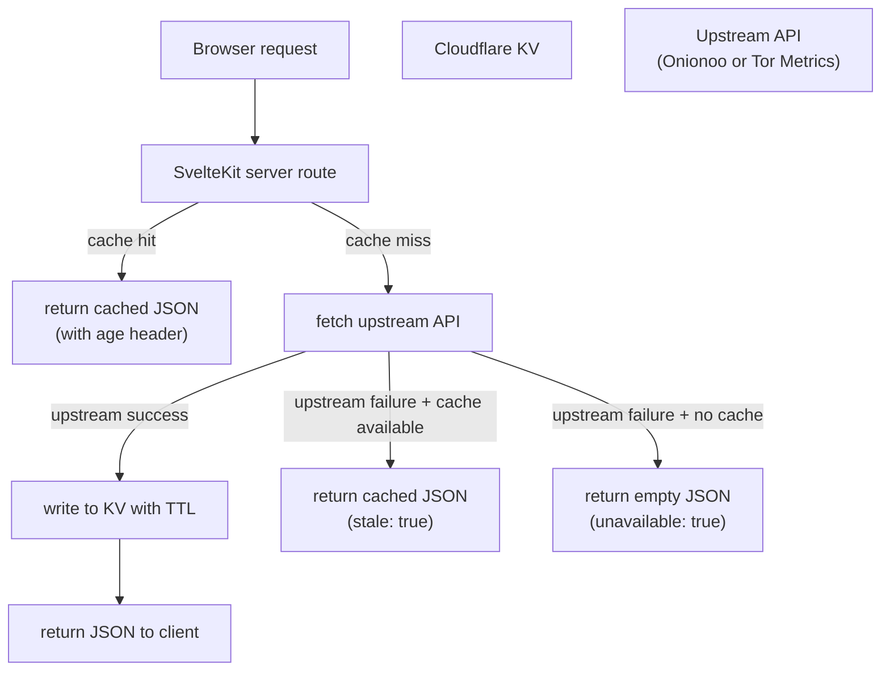

# Data Sources

obfina uses two upstream data sources maintained by the Tor Project.

---

## Onionoo

Base URL: `https://onionoo.torproject.org`

Onionoo provides per-relay and per-bridge data derived from Tor network consensuses. Documents are updated roughly every 3 hours as new consensuses are published.

### Data freshness and consensus lag

Onionoo ingests Tor network consensuses, which are published by directory authorities every hour. However, Onionoo processes them in batches and may lag 3–6 hours behind the live network. A relay that comes online now may not appear in Onionoo's `/summary` endpoint until several hours later. The `relays_published` field in every Onionoo response indicates when the underlying consensus data was last processed — obfina surfaces this timestamp so users know how old the data is.

### Endpoints

#### `GET /summary`

Lightweight list of all relays and bridges.

Key fields per relay:

| Field | Type     | Description                          |
| ----- | -------- | ------------------------------------ |
| `n`   | string   | Relay nickname                       |
| `f`   | string   | Fingerprint (40-char hex)            |
| `a`   | string[] | IP addresses                         |
| `r`   | boolean  | Running in the most recent consensus |
| `c`   | string   | Country code (ISO 3166-1 alpha-2)    |

Note: `r` (running) reflects the most recent consensus Onionoo has processed, not real-time status. A relay that went offline minutes ago may still appear as running.

The `/summary` endpoint does not include per-relay bandwidth or location. obfina therefore exposes its own lightweight startup summary by querying `/details?running=true` with a narrow field filter: `fields=country,observed_bandwidth,guard_probability,middle_probability,exit_probability,flags`. The server aggregates that into `/api/relays?summary=1` so the map can render country totals before full relay details are loaded.

#### `GET /details`

Full relay metadata. obfina fetches `/details?running=true` with a field filter rather than the complete document. The filter is `fields=nickname,as,as_name,observed_bandwidth,consensus_weight,guard_probability,middle_probability,exit_probability,country,flags,first_seen` — everything the views need for per-country aggregation, per-AS centralization, path-selection weighting, drill-down panels, and the circuit simulation. The per-position `*_probability` fields are Onionoo's own path-selection probabilities, so the circuit view samples relays the way Tor weights them.

Key fields:

| Field                | Type     | Description                                                     |
| -------------------- | -------- | --------------------------------------------------------------- |
| `nickname`           | string   | Relay nickname                                                  |
| `fingerprint`        | string   | Fingerprint                                                     |
| `country`            | string   | Country code                                                    |
| `as`                 | string   | Autonomous system number                                        |
| `as_name`            | string   | AS name                                                         |
| `consensus_weight`   | number   | Probabilistic routing weight in the current consensus           |
| `observed_bandwidth` | number   | Bytes/sec observed by the relay; used by obfina for node sizing |
| `flags`              | string[] | e.g. `["Guard", "Exit", "Stable"]`                              |
| `first_seen`         | string   | ISO 8601 timestamp                                              |
| `relays_published`   | string   | ISO 8601 timestamp of the consensus this data is derived from   |

**Data quality notes:**

- **Onionoo does not expose per-relay latitude/longitude.** Coordinates were removed from the API for privacy reasons; geolocation is provided only at the country level (`country`, `country_name`) plus optional `as`/`as_name`. obfina therefore aggregates relays by `country` and fills each country's territory on the map (value-by-alpha), joining Onionoo's ISO alpha-2 country codes to the `world-atlas` boundaries (which use ISO numeric IDs) via `i18n-iso-countries`. This is verified against the live API: a request for `fields=...latitude,longitude...` returns those fields empty.
- `consensus_weight` is not bandwidth. It is the weight assigned by directory authorities for probabilistic relay selection. A relay with high consensus weight receives proportionally more circuits. It correlates with bandwidth but is not equal to it.
- `observed_bandwidth` is self-reported by the relay and unverified. obfina uses it for bandwidth totals and relay-list bars. The actual measured bandwidth used for `consensus_weight` calculation is not exposed via Onionoo.

### Query parameters

All endpoints accept:

| Parameter | Description                                    |
| --------- | ---------------------------------------------- |
| `search`  | Filter by fingerprint, nickname, or IP         |
| `country` | Filter by ISO country code                     |
| `as`      | Filter by AS number                            |
| `flag`    | Filter by relay flag (e.g. `Guard`, `Exit`)    |
| `running` | `true` to return only currently running relays |
| `fields`  | Comma-separated list of fields to include      |

### Acceptable use

Onionoo does not publish formal rate limits but asks consumers to be polite. Polling more frequently than once per 5 minutes is considered abusive. For questions about API usage, contact the Tor Project's metrics team via [metrics@torproject.org](mailto:metrics@torproject.org).

obfina's cache layer enforces a minimum TTL of 10 minutes for relay data.

---

## Tor Metrics

Base URL: `https://metrics.torproject.org`

Tor Metrics provides aggregate statistics about the network, collected and processed by the Tor Project's metrics team. Data is available as JSON and CSV and is typically updated once per day. It is suitable for historical trend visualizations but not for real-time relay state.

The GROWTH view consumes three CSV exports through the cached `/api/trends` route, which parses, bounds (last ~2 years for users), and downsamples them into one compact payload:

| CSV                           | Columns used         | Drives                                |
| ----------------------------- | -------------------- | ------------------------------------- |
| `networksize.csv`             | `date,relays`        | Relay-count growth                    |
| `bandwidth.csv`               | `date,advbw,bwhist`  | Advertised capacity vs. consumed      |
| `userstats-relay-country.csv` | `date,country,users` | Estimated users for the top countries |

Each section degrades independently: if one CSV is unavailable the route returns that section empty and flags the response `partial`, and the view shows a placeholder for it rather than failing.

### Key datasets

#### Network size

Estimated number of relays and bridges over time, broken down by relay flags.

Endpoint: `GET /networksize.json`

#### Bandwidth

Aggregate advertised and consumed bandwidth across all relays.

Endpoint: `GET /bandwidth.json`

#### User statistics

Estimated number of directly connecting users per country per day, derived from relay request counts. obfina uses this for the Growth view's country user trends.

Endpoint: `GET /userstats-relay-country.json`

#### Onion services

Statistics about the number of `.onion` services and their usage, derived from HSDir relay observations. This dataset is not currently consumed by obfina.

Endpoint: `GET /hidserv-dir-onions-seen.json`

---

## Data flow in obfina

The client never calls Onionoo or Tor Metrics directly. All upstream requests are proxied through obfina's server routes, which normalize response shapes, apply caching, and handle upstream failures gracefully. `/api/relays?summary=1` serves the compact country summary, `/api/relays` serves full relay details, and `/api/trends` serves the Growth view. When an upstream API is unavailable and no cached value exists, the API returns `{ unavailable: true }` so the client can render a degraded state rather than a broken one.
